# ☕ Cafe MSA – MSA 기반 커피전문점 웹사이트

Spring Boot 3 기반으로 구현한 **마이크로서비스 아키텍처(MSA)** 예제 프로젝트입니다.  
커피전문점 웹사이트를 도메인으로 삼아 **상품 조회 · 주문 · 장바구니 · 즐겨찾기(찜) · 발주 관리** 등을  
여러 개의 독립된 마이크로서비스로 나누어 구현했습니다.

- 팀명: **CodeWave**
- 레포지토리: `CafeMSA`
- 모듈 구조: **멀티 모듈 Gradle 프로젝트**  
  (`auth-service`, `product-service`, `cart-service`, `order-service`,  
  `bookmark-service`, `gateway-service`, `eureka-server`,  
  `order-cart-service`, `order-product-service`, `order-orderlist-service` …)


## 📌 주요 기능

### 👤 사용자(손님) 기능

- 회원가입 / 로그인 (**JWT 기반 인증**)
- 메뉴(상품) 목록 조회 및 상세 조회
- 장바구니 담기 / 수량 변경 / 삭제
- 주문 생성 및 주문 내역 조회
- 즐겨찾기(찜) 등록 / 해제 / 즐겨찾기 목록 조회
- 로그인 상태 및 권한에 따른 네비게이션 · 화면 구성

### 👨‍🍳 점주(관리자) 기능

- 상품(메뉴) 등록 / 수정 / 삭제
- 발주용 상품 목록 관리
- 발주 장바구니 작성 (`order-cart-service`)
- 발주 생성 및 발주 목록 / 상세 조회 (`order-orderlist-service`)
- 발주와 연동되는 발주 상품 관리 (`order-product-service`)

### 🏗 플랫폼 / 인프라 기능

- **Spring Cloud Gateway** 기반 API Gateway (WebFlux 기반 비동기 처리)
- **Netflix Eureka** 기반 서비스 디스커버리 (Server & Client)
- 각 마이크로서비스별 **독립 DB** (H2 / MySQL 등 프로필에 따라 분리)
- **JWT + Spring Security** 기반 인증/인가
- 공통 Frontend (**HTML/Thymeleaf + JS + Bootstrap**)를 **Gateway**에서 제공
- 일부 발주 도메인 서비스에서 **RabbitMQ**를 사용한 비동기 메시지 처리


## 📸 화면 미리보기 (Screenshots)

> `docs/images/` 폴더를 만들고 실제 캡처 이미지를  
> 해당 파일명으로 저장하면 README에서 이미지가 표시됩니다.

### 🏠 메인 화면

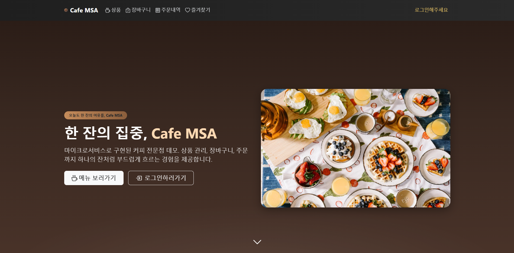

### ☕ 상품 목록 & 상세

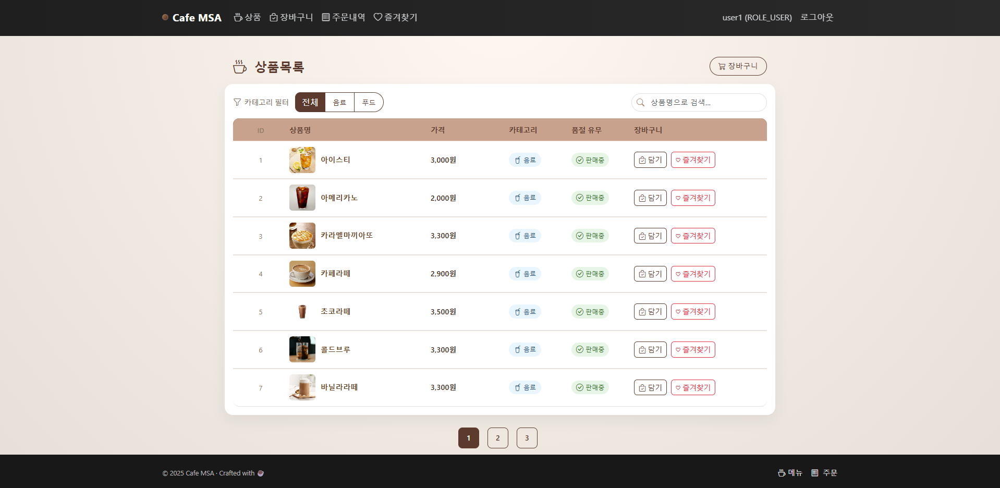  
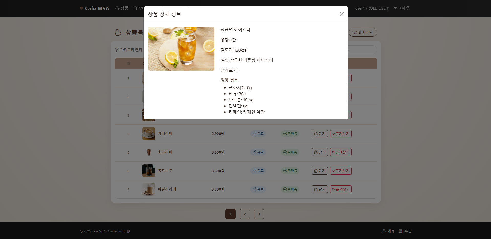

### 🛒 장바구니 & 주문

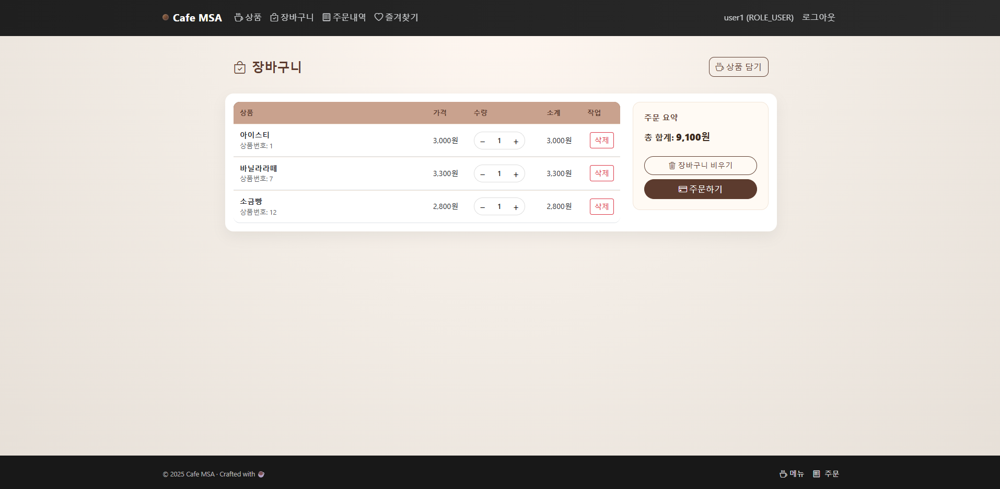  
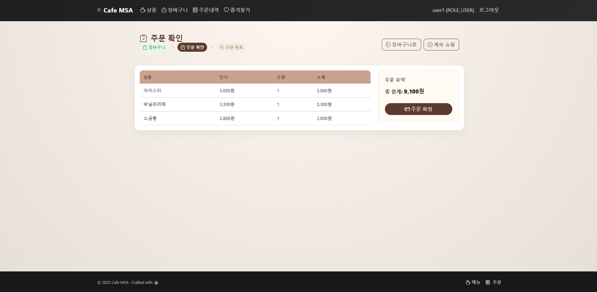
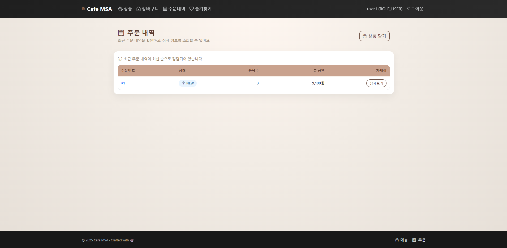
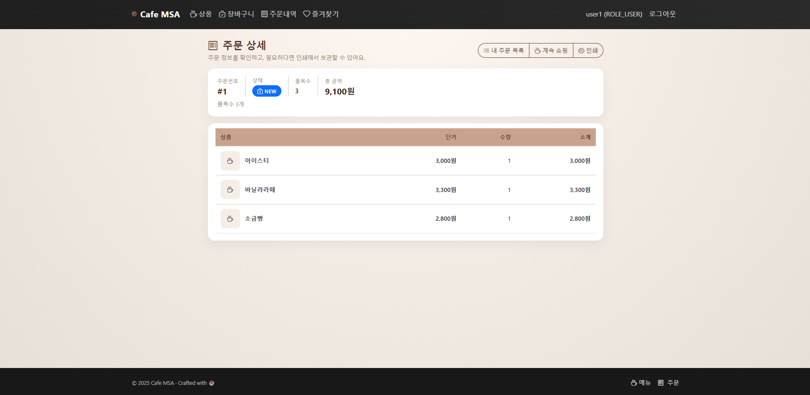

### ❤️ 즐겨찾기(찜) 화면

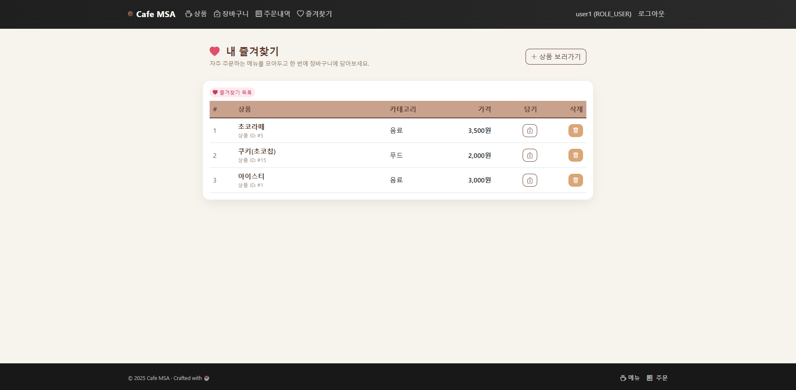

### 📦 발주 관리(점주용)
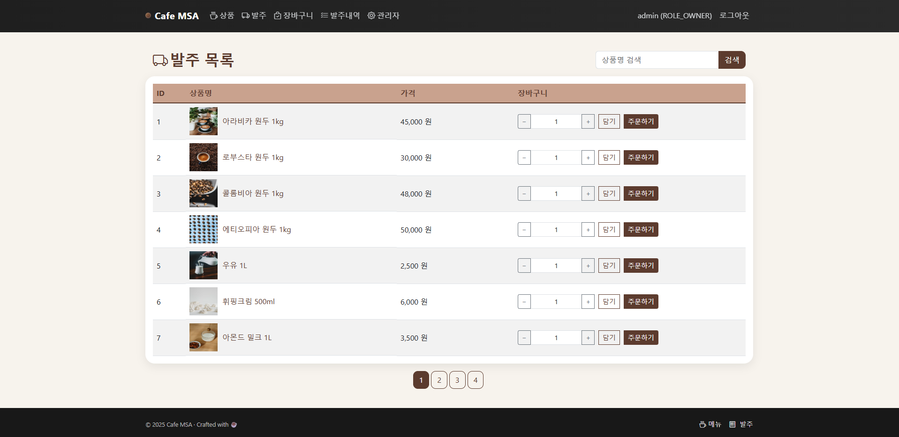
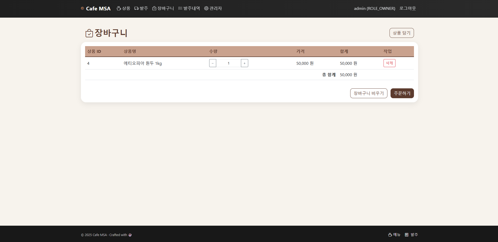  
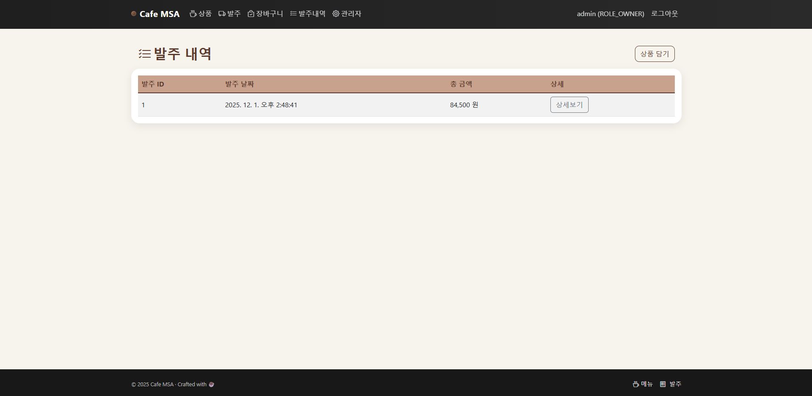
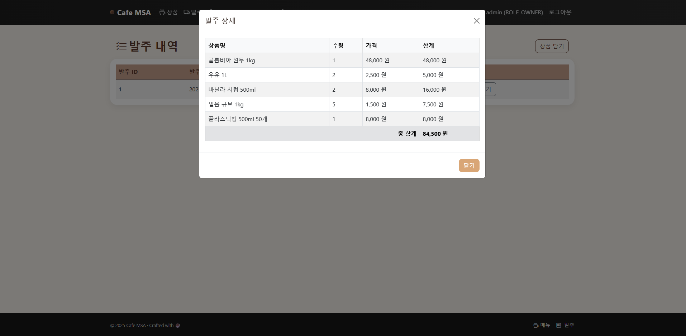

### 🧱 MSA 아키텍처 다이어그램

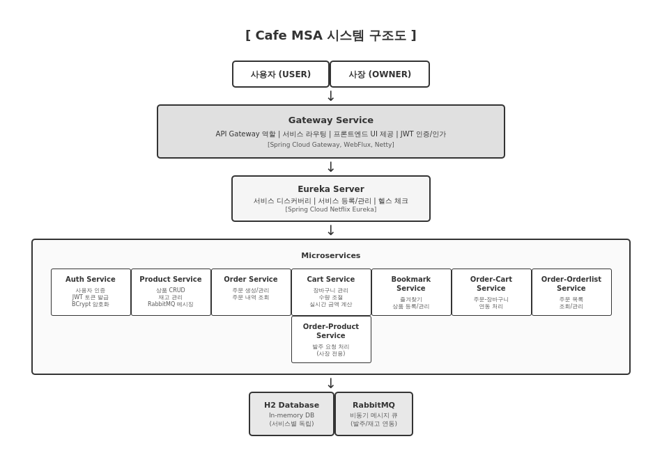


## 🧰 기술 스택

### Backend

- **Java 17**
- **Spring Boot 3.1.x**
- **Spring Cloud 2022.x**
- **Spring Web / Spring WebFlux (Gateway)**
- **Spring Cloud Gateway**
- **Spring Security, JWT**
- **Spring Data JPA**
- **Eureka Server / Eureka Client**
- **Gradle (Multi-module build)**
- **Lombok**
- **RabbitMQ** (발주 관련 서비스에서 메시지 큐로 사용)

### Database

- **H2 Database** (로컬 개발용, 인메모리 / 파일 모드)
- **MySQL** (실습/운영 시 확장 가능하도록 설계)
- 각 서비스별 **스키마 및 데이터 분리** (`schema.sql`, `data.sql` 사용)

### Frontend

- HTML5, CSS3
- **Thymeleaf 템플릿**
- JavaScript (**Fetch API** 기반 비동기 통신)
- **Bootstrap 5**, **Bootstrap Icons**


## ⚙️ Gateway & WebFlux 특징

### Spring Cloud Gateway

- **Netty 기반 비동기, 논블로킹(Non-blocking) 아키텍처**
- **Project Reactor + Spring WebFlux** 기반
- 적은 리소스로 **높은 동시성 요청 처리** 가능
- 서비스 이름 기반의 **동적 라우팅** 지원
- 공통 **인증 필터**, **로깅**, **CORS**, **정적 리소스 제공** 역할 수행

### WebFlux vs Spring MVC

- **WebFlux**
  - 비동기 / 논블로킹 방식
  - Netty 기반, 요청당 스레드 점유가 적어 고동시성에 유리
- **Spring MVC**
  - 동기식 / 서블릿 기반
  - 요청당 스레드 1개 할당 방식

> 본 프로젝트에서는 **Gateway 서비스에 WebFlux**를 사용하고,  
> 개별 비즈니스 서비스(`auth`, `product`, `cart`, `order` 등)는  
> 일반적인 **Spring MVC(RestController)** 스타일로 구현했습니다.


## 🏗 아키텍처 개요

프로젝트는 커피전문점 도메인을 기준으로 다음과 같이 마이크로서비스를 분리했습니다.


Client(브라우저)
        ↓
Spring Cloud Gateway (gateway-service, WebFlux)
        ↓
+----------------+----------------+----------------+---------------------+
| auth-service   | product-service| cart-service   | order-service       |
| (인증/회원)    | (상품/메뉴)    | (장바구니)     | (사용자 주문/결제)   |
+----------------+----------------+----------------+---------------------+
        ↓                       ↓
  bookmark-service        order-XXX-services
   (즐겨찾기/찜)   (발주 장바구니 / 발주 상품 / 발주 목록)
````

서비스 등록/탐색은 **Eureka Server(`eureka-server`)** 가 담당하며,
**Gateway**에서 서비스 이름으로 라우팅하여 각 서비스에 접근합니다.


## 📁 프로젝트 구조

루트 레포지토리(`CafeMSA/`) 기준 구조입니다.


CafeMSA/
├── gateway-service           # API Gateway + 공통 UI (포트: 8000)
├── eureka-server             # 서비스 디스커버리 서버 (포트: 8761)
├── auth-service              # 인증/인가 및 회원 관리 (포트: 8010)
├── product-service           # 메뉴/상품 관리 (포트: 8001)
├── cart-service              # 사용자 장바구니 관리 (포트: 8005)
├── bookmark-service          # 즐겨찾기(찜) 관리 (포트: 8006)
├── order-service             # 사용자 주문(결제/주문내역) 관리 (포트: 8002)
├── order-product-service     # 발주 대상 상품/재고 관리 (포트: 8014)
├── order-cart-service        # 발주용 장바구니 관리 (포트: 8012)
├── order-orderlist-service   # 발주 목록/이력 관리 (포트: 8013)
├── build.gradle              # 루트 빌드 스크립트
├── settings.gradle           # 멀티 모듈 설정
└── README.md


## 🧩 모듈별 역할

### 1. `gateway-service` (API Gateway & Frontend, 포트: 8000)

* WebFlux 기반 **Spring Cloud Gateway**
* 클라이언트(브라우저)의 모든 요청을 수신하여 각 서비스로 라우팅
* 역할

  * 공통 레이아웃(네비게이션, 푸터), 메인 페이지, 로그인/회원가입/상품/장바구니/주문 등 **UI 제공**
  * **JWT 토큰**을 Authorization 헤더로 각 서비스에 전달
  * **CORS**, 로깅, 인증 필터 등 공통 정책 적용
  * 정적 리소스(HTML/CSS/JS, 이미지) 제공

### 2. `eureka-server` (Service Discovery, 포트: 8761)

* 각 마이크로서비스에서 Eureka Client로 등록
* 서비스 이름 기반 라우팅을 지원하여 **IP/포트 변경에 유연**
* Eureka 대시보드를 통해 서비스 상태 확인 가능

### 3. `auth-service` (인증/회원 관리, 포트: 8010)

* 회원가입 / 로그인 API 제공
* **BCrypt**를 이용한 비밀번호 해시 저장
* **JWT 발급/검증** 로직 제공
* 사용자 역할

  * `ROLE_USER`, `ROLE_OWNER`, `ROLE_ADMIN` 등
* H2 DB 또는 MySQL 사용 (프로필에 따라 변경 가능)

### 4. `product-service` (상품/메뉴 관리, 포트: 8001)

* 커피, 음료, 디저트 등의 메뉴 관리
* 관리자:

  * 상품 등록/수정/삭제
* 사용자:

  * 상품 목록 조회
  * 상품 검색/필터(카테고리 등)
  * 상품 상세 조회
* `schema.sql`, `data.sql`을 이용한 초기 데이터 로딩

### 5. `cart-service` (장바구니 서비스, 포트: 8005)

* 사용자별 장바구니 관리
* 기능:

  * 상품 장바구니 담기
  * 수량 변경
  * 장바구니에서 상품 삭제
  * 장바구니 목록 조회
* 보통 `X-USER-ID` 헤더(또는 JWT 파싱)를 기준으로 **유저별 장바구니 분리**
* H2 DB 사용

### 6. `order-service` (사용자 주문 서비스, 포트: 8002)

* 장바구니에 담긴 상품으로 **주문 생성**
* 주문 상태 관리 (예: `NEW`, `PAID`, `COMPLETED` 등)
* 사용자별 주문 내역/상세 조회
* 필요 시 다른 서비스(예: 결제, 재고 등)와 연동 가능하도록 설계

### 7. `bookmark-service` (즐겨찾기/찜 서비스, 포트: 8006)

* 사용자가 자주 주문하는 메뉴를 **즐겨찾기(찜)** 로 관리
* 기능:

  * 즐겨찾기 등록 / 삭제
  * 즐겨찾기 목록 조회
* UI에서는 보통 **하트 아이콘 토글** 형태로 표시

### 8. 발주 도메인 (`order-cart-service` / `order-product-service` / `order-orderlist-service`)

점주(사장님)를 위한 **발주 관리 도메인**을 담당합니다.

* `order-cart-service` (포트: 8012)

  * 발주용 장바구니
  * 카페에서 필요한 **원두/재료**를 장바구니처럼 담아 **발주서 초안** 작성
  * 일부 기능에서 **RabbitMQ** 사용 가능

* `order-product-service` (포트: 8014)

  * 발주 대상 상품(원두, 컵, 시럽 등) 관리
  * 발주 관점에서의 상품 목록 제공

* `order-orderlist-service` (포트: 8013)

  * 실제 발주서 생성
  * 발주 목록/이력 조회
  * 메시지 큐(RabbitMQ)와 연동하여 비동기 처리 가능


## 🔐 인증 & 테스트 계정 예시

> 실제 코드에 설정된 계정/비밀번호에 맞게 필요 시 수정해서 사용하세요.


관리자 (점주) 예시
- username: admin
- password: admin123
- role: ROLE_OWNER

일반 사용자 예시
- username: user1
- password: user123
- role: ROLE_USER
```

추가 테스트 계정(`user2` 등)이 설정되어 있을 수 있으므로
실제 `auth-service`의 초기 데이터 또는 `DataInitializer`를 참고하세요.


## 🚀 실행 방법

### 1. 필수 요구사항

* **JDK 17 이상**
* **Gradle**
* (선택) **RabbitMQ** – 발주 도메인에서 메시지 큐 기능을 사용할 경우 필요

### 2. 서비스 실행 순서 (권장)

1. **Eureka Server 실행**


cd eureka-server
./gradlew bootRun


2. **Gateway Service 실행**


cd gateway-service
./gradlew bootRun


3. **Auth Service 실행**

cd auth-service
./gradlew bootRun


4. **나머지 서비스 실행 (순서는 크게 상관 없음)**


cd product-service
./gradlew bootRun

cd cart-service
./gradlew bootRun

cd bookmark-service
./gradlew bootRun

cd order-service
./gradlew bootRun

cd order-product-service
./gradlew bootRun

cd order-cart-service
./gradlew bootRun

cd order-orderlist-service
./gradlew bootRun


### 3. 접속

* 브라우저에서 접속:
  👉 [http://localhost:8000](http://localhost:8000)

Gateway를 통해 공통 UI에 접근하고, 내부적으로 각 마이크로서비스로 라우팅됩니다.


## 📡 주요 API 예시

> 실제 엔드포인트 경로나 파라미터는
> **구현된 코드에 맞춰 조정**해 사용하세요.

### Auth Service

* `POST /api/auth/login` – 로그인 (JWT 발급)
* `POST /api/auth/signup` – 회원가입(구현 시)
* 예시 요청


{
  "username": "user1",
  "password": "user123"
}


* 예시 응답

{
  "token": "JWT_TOKEN_STRING",
  "username": "user1",
  "role": "ROLE_USER"
}


### Product Service

* `GET /api/products` – 상품 목록 조회
* `GET /api/products/{id}` – 상품 상세 조회
* `POST /api/products` – 상품 등록 (관리자)
* `PUT /api/products/{id}` – 상품 수정 (관리자)
* `DELETE /api/products/{id}` – 상품 삭제 (관리자)


### Cart Service

(예: `X-USER-ID` 헤더 또는 JWT에서 사용자 식별)

* `GET /api/cart` – 내 장바구니 조회
* `POST /api/cart` – 장바구니에 상품 추가
* `PUT /api/cart/{itemId}` – 장바구니 수량 변경
* `DELETE /api/cart/{itemId}` – 장바구니 항목 삭제


### Order Service

* `POST /api/orders/checkout` – 장바구니 → 주문 생성
* `GET /api/orders` – 내 주문 목록 조회
* `GET /api/orders/{id}` – 주문 상세 조회


### Bookmark Service

* `GET /api/bookmarks` – 즐겨찾기 목록
* `POST /api/bookmarks` – 즐겨찾기 추가
* `DELETE /api/bookmarks/{id}` – 즐겨찾기 삭제


## 🧪 개발 & 학습 포인트

* **MSA 환경에서의 서비스 분리 전략**

  * 인증, 주문, 장바구니, 즐겨찾기, 발주 도메인 등으로 분리
* **Spring Cloud Gateway + Eureka**를 이용한 서비스 라우팅 및 디스커버리
* **JWT 기반 인증/인가 구조**와 Gateway 연동 방식
* **도메인 분리 + DB 분리**를 통한 마이크로서비스 설계 경험
* **Frontend(Thymeleaf + JS)**와 **Backend REST API** 연동
* WebFlux 기반 Gateway와 MVC 기반 서비스의 **혼합 아키텍처 경험**
* (선택) RabbitMQ를 활용한 **비동기 메시지 처리** 패턴 학습


## 📄 License

이 프로젝트는 **수업/스터디용 예제 프로젝트**입니다.
별도의 라이선스 명시 전까지는 **개인 학습 및 포트폴리오 용도**로 자유롭게 활용하실 수 있습니다.

